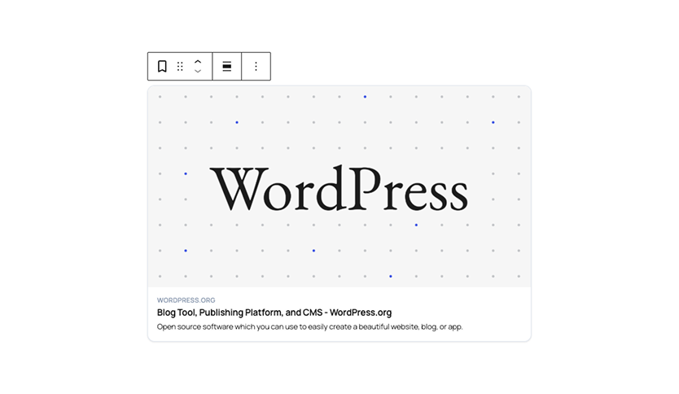

# Better Bookmarks

A WordPress block that fetches Open Graph metadata from a URL and renders a link preview card.



## Requirements

- WordPress 6.5+
- PHP 7.2+
- Node.js (for building from source)

## Installation

Clone or download the plugin into `wp-content/plugins/better-bookmarks/`, then build the assets:

```bash
npm install
npm run build
```

Activate the plugin from the WordPress admin. The built `build/` directory must be present — the plugin does not ship pre-built assets.

## Usage

Add the **Link Card** block from the block inserter (category: Better Bookmarks). Paste a URL into the placeholder input and press Enter, or enter the URL in the sidebar panel and click **Fetch Preview**. The block calls the REST API, stores the metadata as block attributes, and renders server-side on the frontend.

The card displays the OG image, domain, title, and description. Once a preview is loaded, the image aspect ratio can be changed from the sidebar using the same aspect ratio presets available to the Image block. The default is `1.91:1` (the OG spec recommendation).

The editor preview is not clickable. The frontend card opens the URL in a new tab.

## REST API

**`GET /wp-json/better-bookmarks/v1/preview`**

Requires `edit_posts` capability.

| Parameter | Required | Description |
|-----------|----------|-------------|
| `url` | Yes | The URL to fetch. Must be a valid public http/https URL. Private and reserved IP ranges are blocked. |

**Response**

```json
{
  "url": "https://example.com",
  "title": "Page title",
  "description": "OG or meta description, truncated to 200 characters.",
  "image": "https://example.com/image.jpg",
  "domain": "example.com",
  "imageWidth": 1200,
  "imageHeight": 630
}
```

Metadata is extracted via regex from the raw HTML response. Image dimensions come from `og:image:width`/`og:image:height` meta tags if present; otherwise the endpoint probes the image URL with `getimagesize()`. If that also fails, dimensions are returned as `0`.

On a failed `wp_remote_get()`, the endpoint returns a `400` with `{ "error": "..." }`.

## Block Attributes

| Attribute | Type | Default | Description |
|-----------|------|---------|-------------|
| `url` | string | `""` | The linked URL |
| `title` | string | `""` | OG title |
| `description` | string | `""` | OG description |
| `image` | string | `""` | OG image URL |
| `domain` | string | `""` | Parsed domain (www. stripped) |
| `imageWidth` | integer | `0` | Image width in px |
| `imageHeight` | integer | `0` | Image height in px |
| `imageAspectRatio` | string | `""` | Override aspect ratio (e.g. `16/9`) |

## Development

```bash
npm start          # Webpack watch mode
npm run build      # Production build
npm run lint       # ESLint + Stylelint
composer run lint  # PHPCS (WordPress coding standards)
composer run lint:fix  # PHPCBF auto-fix
```

Source files are in `src/blocks/link-card/`. Built output goes to `build/`.

## Limitations

- Metadata is fetched at edit time and stored in block attributes. The card does not update automatically if the linked page changes.
- The REST endpoint fetches pages server-side, so it won't see content injected by JavaScript.
- Meta tag parsing uses regex, not a DOM parser. Malformed HTML or non-standard attribute ordering may cause extraction to fail silently (empty strings are stored).
- No caching. Each preview fetch is a fresh HTTP request with a 10-second timeout.
- Description is hard-truncated at 200 characters by the REST endpoint, not per-block.
- `getimagesize()` on remote images requires `allow_url_fopen` to be enabled in PHP. If it isn't, image dimensions fall back to `0` and the default aspect ratio is used.
